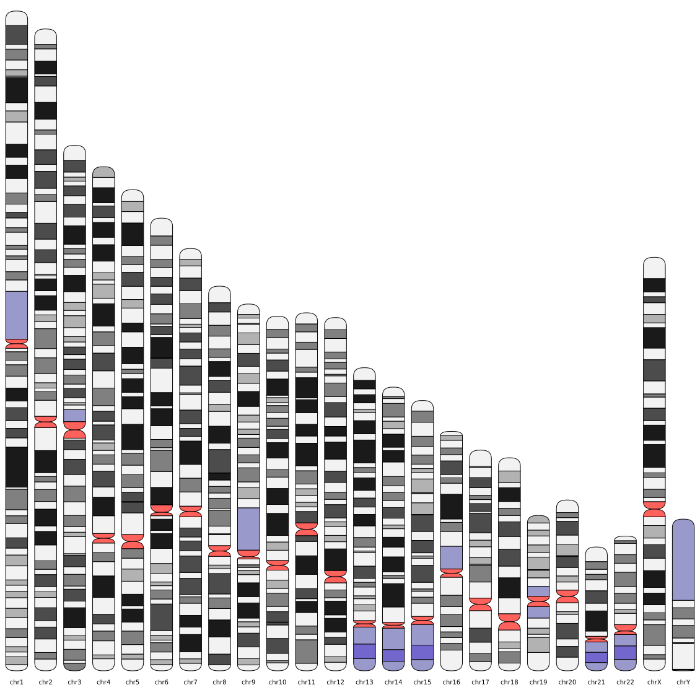
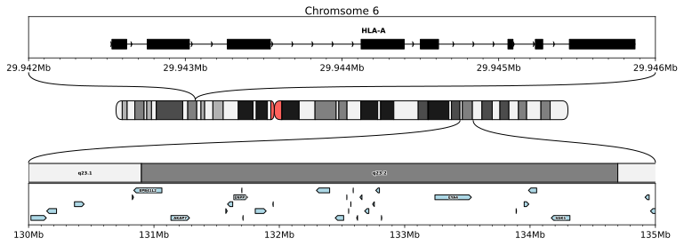

# pyideogram

## Introduction

This is a python package to plot ideograms in matplotlib, as well as simple gene tracks. I made this primarily for myself, since I could not find any nice looking svg supporting ideogram package in python that works well with matplotlib. The general design idea is that the functions should be intuitive to use for someone familiar with matplotlib and give reasonably well looking output with minimal configuration, but should also have the flexibility of other matplotlib functions. So the underlying matplotlib functions can be manipulated directly by giving the correct kwargs.

## Installation

You can easily install it via pip from pypi

```bash
pip install pyideogram
```

or install it manually:

```bash
git clone https://github.com/balthasar-eu/pyideogram.git
cd pyideogram
pip install .
```

Dependencies are python3.10, matplotlib and numpy

## Usage

The package comes with integrated cytobands files for hg19 and hg38, as well as [MANE transcripts](https://www.ncbi.nlm.nih.gov/refseq/MANE/) (only positions, and orientation) for hg38. If you run any of the functions without providing annotation files, it will assume you want to use the stored ones.

The package currently has `ideogramh` and `ideogramv` which plot horizontal and vertical ideograms respectively, as well as a `genetrack` function, which can plot transcripts and exons from gtf files.
`full_ideogram` iterates over all chromosomes and plots them with either `ideogramh` or `ideogramv`. Help is available for all functions int he docstring, which you can get with `help()`.


## Examples

```python
import pyideogram
fig = pyideogram.full_ideogram()
fig.show()
```




```python
import pyideogram
from matplotlib import pyplot as plt

chrom = "chr6"

fig = plt.figure(figsize=(10, 4), dpi=150)

fig.suptitle("Chromsome 6")

gs = fig.add_gridspec(
    nrows=6,
    ncols=3,
    width_ratios=[2, 20, 2],
    height_ratios=[1, 1, 0.5, 1, 0.5, 1],
    hspace=0.01,
    left=0.01,
    right=0.99,
    top=0.94,
)

start = 29942000
end = 29946000

ax = fig.add_subplot(gs[0, :])

pyideogram.genetrack(
    f"{chrom}:{start}-{end}",
    ax=ax,
    textlane=True,
    transcriptstyle="arrowed",
    exonstyle="Box",
)

all_chrom = fig.add_subplot(gs[2, 1])
all_chrom.axis("off")
all_chrom.set_xticks([])

pyideogram.ideogramh(chrom, ax=all_chrom)
pyideogram.zoom(ax, all_chrom)

pyideogram.set_genome_xticks(ax)

start = 130000000
end = 135000000

ax = fig.add_subplot(gs[5, :])

pyideogram.genetrack(
    f"{chrom}:{start}-{end}",
    ax=ax,
    lanenum=5,
    trackkwargs={
        "color": "lightblue",
    },
    textlane=False,
    text_clip_width=True,
)

pyideogram.set_genome_xticks(ax)

ax = fig.add_subplot(gs[4, :], sharex=ax)

ax.set_xlim(start, end)
pyideogram.ideogramh(chrom, ax=ax, names=True)

pyideogram.zoom(ax, all_chrom)
plt.axis("off")
ax.tick_params(labelbottom=False)
```



## Citation

There is currently no publication attached to this package.

If you use the provided annotation for plotting genes, you might want to cite the [MANE paper](https://www.nature.com/articles/s41586-022-04558-8).

You might also want to cite [matplotlib](https://matplotlib.org/stable/users/project/citing.html).

